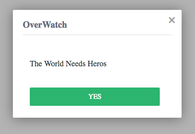
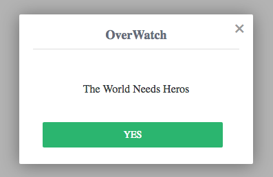
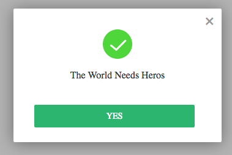
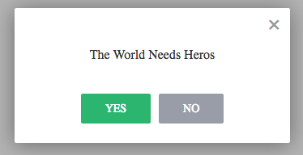
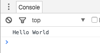
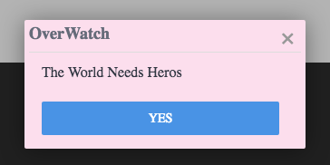

# vue-alert-go
More Details in [api docs](./API.md) :)

Some examples are following:

## Basic
only `title` and `msg`.

```javascript
import vueAlert from '../src'

vueAlert({
  title: 'OverWatch',
  msg: 'The World Needs Heros',
})
```




## Align
you can specify the `align` property to align text.

```javascript
vueAlert({
  title: 'OverWatch',
  msg: 'The World Needs Heros',
  align: 'center', // add this!
})
```




## Icon
specify status icon via `icon` property.

```javascript
import correctIcon from './correct.svg'

vueAlert({
  msg: 'The World Needs Heros',
  align: 'center', 
  icon: correctIcon, // add this!
})
```




## Handler
If you like, you can add some listeners for some events. e.g. `onClickYesBtn`.

```javascript
vueAlert({
  msg: 'The World Needs Heros',
  align: 'center',
  needNoBtn: true,
  onClickYesBtn() {
    console.log('Hello World')
  }, // add this!
})
```





## Style
Customize some default styles by `style` prop.

```javascript
vueAlert({
  title: 'OverWatch',
  msg: 'The World Needs Heros',
  style: {
    padding: '5px',
    yesBtnColor: '#4993e5',
  }, // add this
})
```


## Animate
There some 3 types of animation.

```javascript
vueAlert({
  title: 'OverWatch',
  msg: 'The World Needs Heros',
  animate: 'bound', // fade, bound, slide
})
```